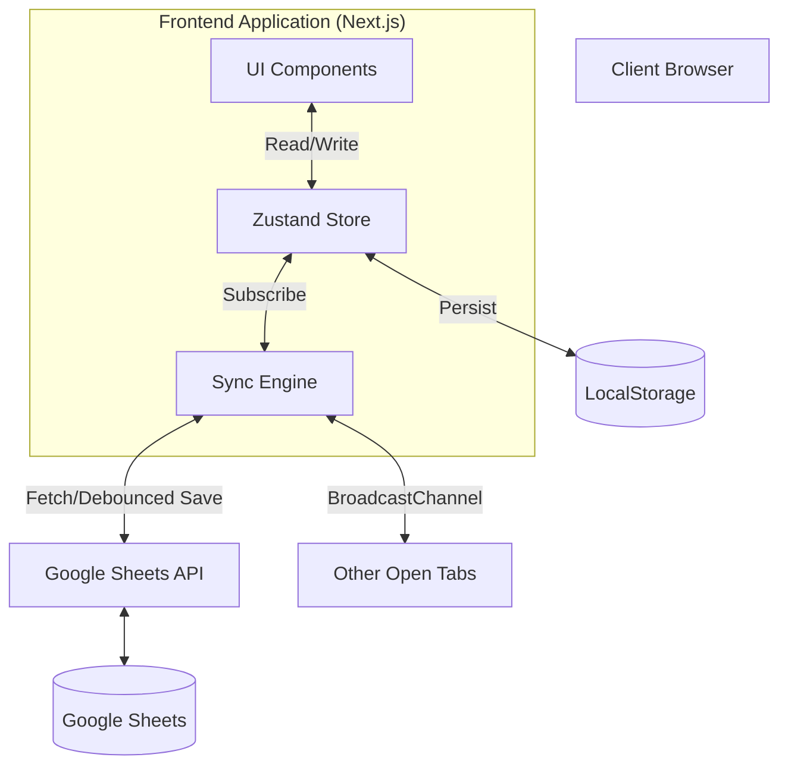

# System Architecture Report - Pulse-Fit

## 1. Executive Summary
Pulse-Fit is a modern web application designed for gym management and member engagement. It features a high-performance public-facing website, a member dashboard, and a comprehensive admin panel. The system leverages a serverless architecture with **Next.js** on the frontend and **Google Sheets** as a lightweight, flexible backend database. State management is handled by **Zustand** with robust offline capabilities and cross-tab synchronization.

## 2. Technology Stack

### Core Frameworks & Languages
- **Framework**: Next.js 16.1.1 (React 19)
- **Language**: TypeScript 5.0+
- **Styling**: Tailwind CSS v3.4, `clsx`, `tailwind-merge`

### State Management & Data
- **Global Store**: Zustand v5.0.9
- **Persistence**: `zustand/middleware` (localStorage)
- **Data Sync**: `BroadcastChannel` API for cross-tab synchronization
- **Backend/Database**: Google Sheets (accessed via Google Apps Script Web App)

### UI & Interaction
- **Animations**: Framer Motion
- **Icons**: Lucide React
- **Specific Components**: `react-qr-code` for Access Control

## 3. System Architecture

The application follows a **Client-Side First** architecture where the global store serves as the single source of truth, periodically syncing with the remote Google Sheets backend.

### Data Flow
1.  **Initialization**: On load, the app fetches data from Google Sheets via `lib/api.ts` and hydrates the Zustand store.
2.  **User Action**: UI updates the Zustand store immediately (optimistic UI).
3.  **Local Persistence**: Changes are saved to `localStorage`.
4.  **Synchronization**:
    *   **Cross-Tab**: `BroadcastChannel` notifies other open tabs to update their state instantly.
    *   **Remote Save**: A debounced mechanism (2-second delay) triggers a POST request to the Google Sheets API to save changes.

## 4. Module Breakdown

### A. Admin Panel (`/admin`)
Isolated environment for managing gym operations.
*   **Dashboard** (`/admin`): Overview of key metrics.
*   **Members** (`/admin/members`): User management (Add, Edit, Deactivate).
*   **Plans** (`/admin/plans`): Subscription plan configuration (Standard, Premium, Enterprise).
*   **Maintenance** (`/admin/maintenance`): Equipment tracking and status reporting.
*   **Staff** (`/admin/staff`): Trainer and staff management.
*   **Leads** (`/admin/leads`): Tracking potential member inquiries.
*   **Access** (`/admin/access`): QR code generation or biometric logs.
*   **Schedule** (`/admin/schedule`): Class and shift scheduling.

### B. Public Website (`/`)
High-performance landing pages designed for conversion.
*   **Homepage**:
    *   **Hero Section**: High-impact visual introduction.
    *   **Features**: Teasers of facility capabilities.
    *   **Comparisons**: Premium vs. Standard plan breakdown.
    *   **Team**: Trainer profiles.
    *   **Reviews**: Integrated Google Reviews.
*   **Subpages**:
    *   `/about`: Detailed gym history and team bios.
    *   `/facility`: Full inventory of equipment and amenities.
    *   `/pricing`: Detailed pricing tables and signup links.
    *   `/contact`: Location and inquiry forms.
    *   `/register`: New member signup flow.

### C. Member Portal (`/dashboard`)
Protected area for registered members.
*   **Dashboard**: Personalized view for members to track workouts, view active plans, and access member-specific resources.

## 5. Key File Structure
*   `lib/store.ts`: The heart of the application. Contains the Zustand store definition, actions, and the custom synchronization logic (BroadcastChannel + API syncing).
*   `lib/api.ts`: Abstraction layer for communicating with the Google Sheets backend.
*   `app/(admin)`: Route group for all admin pages.
*   `app/(public)`: Route group for public marketing pages.
*   `components/`: Reusable UI components, separated into `ui` (atoms) and `sections` (complex blocks).

## 6. Current implementation Details
- **Error Handling**: The store now implements filtering to preventing `DataCloneError` during state broadcasting.
- **Performance**: Heavy use of `next/image` and lazy loading.
- **SEO**: Semantic HTML structure in public pages (Hero, Features, FAQ sections).
